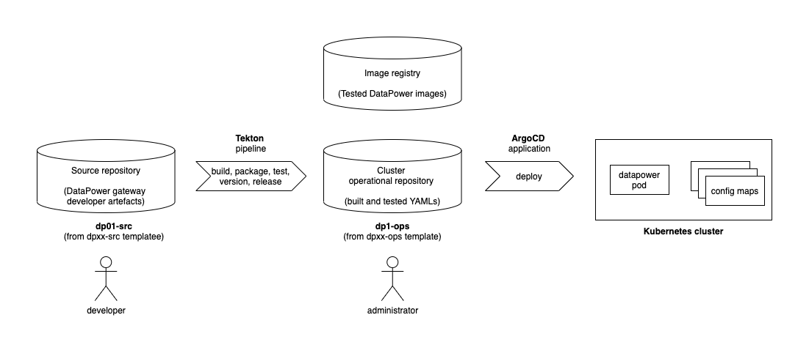

# DataPower automation

## Overview

This tutorial demonstrates how to do CICD with DataPower using GitOps on Kubernetes. 

In this tutorial, you will:

1. Create a Kubernetes cluster and image registry, if required.
2. Install ArgoCD applications to manage cluster deployment of DataPower-related Kubernetes resources.
3. Create an operational repository to store DataPower resources that are deployed to the Kubernetes cluster.
4. Create a source Git repository to store the configuration and development artefacts for a virtual DataPower appliance.
5. Run a Tekton pipleline to build, test, version and deliver the DataPower-related resources ready for deployment.
6. Gain experience with the IBM-supplied DataPower operator and container.

At the end of this tutorial, you will have a solid foundation of GitOps and CICD for DataPower in a Kubernetes environment.

---

## Introduction

The following diagram shows a GitOps CICD pipeline for DataPower:



Notice how: 

- The git repository `dp01-src` holds the source configuration for the DataPower `dp01`
- This repository also holds the source for a multi-protocol gateway
- A Tekton pipeline usese the source repository to build, package, test, version and deliver changes to the `dp01` component.
- If the pipeline is successful, then the YAMLs that define `dp01` are stored in the operational repository `dp01-ops`. The container image for `dp01` is stored in an image registry.
- Shortly after the changes are committed to the git repository, an ArgoCD application detects the updated YAMLs. It applies them to the cluster to update the running `dp01`


This tutorial will walk you through the process of setting up this configuration:
- Step 1: Follow [these instructions](https://github.com/dp-auto/dpxx-ops#readme) to set up your cluster, ArgoCD and the `dp01-ops` repository. When complete, proceed to step 2.
- Step 2: Continue with the instructions in this README to create the `dp01-src` respository, run a tekton pipeline to populate it, and interact with the new or updated DataPower appliance `dp01`.

---

## Fork repository
[Fork this repository](https://github.com/dp-auto/dpxx-src/generate) from a `Template`. 
  - Ensure you include all branches by ticking `Include all branches`. 
  - Fork the respository to **your Git user** e.g. `<mygituser>/dp01-src`

---

## Clone repository to your local machine

Open new Terminal

Set userid, to your userid, e.g. `odowdaibm`

```bash
export GITUSER=odowdaibm
```

```bash
mkdir -p $HOME/git/datapower
cd $HOME/git/datapower
git clone git@github.com:$GITUSER/dp01-src.git
```

---

## Work on pipelines

```bash
cd dp01-src
git checkout pipelines
```

---

## Login to cluster

```bash
oc login
```

---

## Locate Datapower pipeline source

```bash
cd $HOME/git/datapower/dp01-src/pipelines/dev-build
ls
```

---

## Create cluster pipeline resources
  
```bash  
oc apply -f dp-clone.yaml		
oc apply -f dp-gen-yamls.yaml	
oc apply -f dp-push.yaml
oc apply -f dp-dev-pipeline.yaml	
oc apply -f dp-store-yamls.yaml
oc apply -f dp-build-image.yaml		
oc apply -f dp-test.yaml
```

---


## Run pipeline

```bash
oc create -f dp-dev-pipelinerun.yaml
```

In the following command replace `xxxxx` with the new pipeline run identifier:

```bash
tkn pipelinerun logs dp-dev-pipeline-run-xxxxx -n dp01-dev -f
```

## View pipelinerun in the web console


